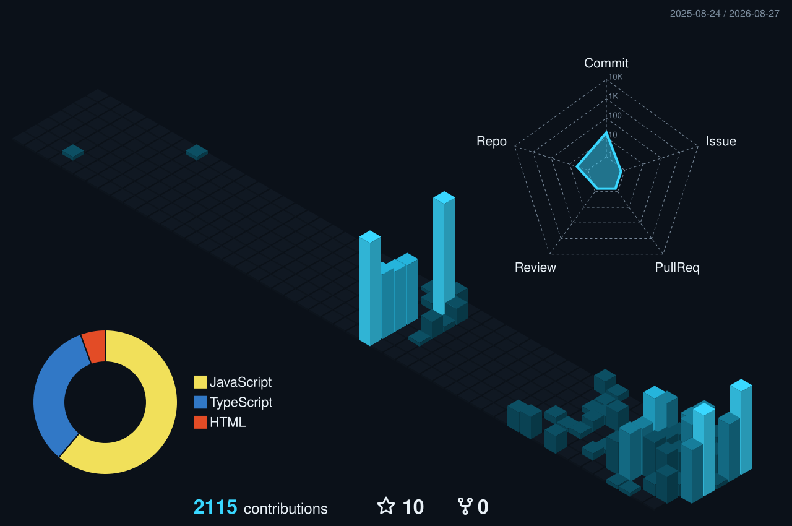

<div align="center">
  
</div>

<div align="center">
  <a href="https://buildary.dev"></a>
  <a href="https://codionx.com"></a>
  <a href="https://github.com/aethrixn?tab=repositories"></a>
  
</div>


## `01` — WHO I AM

I'm **Mirza Şimşek** — a **Management Information Systems** student focused on software and digital product development, product engineer at **[CodionX](https://codionx.com)**, and the builder behind experiments that live where **AI, product design and full-stack systems** collide.

I've been making things since childhood: not because one stack was fashionable, but because an idea felt too interesting to leave imaginary. That instinct now turns into AI-native products, original block libraries, research agents, marketplace systems, mobile apps and interfaces designed from first principle to production edge.

> **I don't collect demos. I build the system behind the demo.**

```ts
const mirza = {
  role:        ['AI Product Builder', 'Management Information Systems Student'],
  studio:      'CodionX',
  flagship:    'buildary.dev',
  defaultMode: 'turn the strange idea into the working product',
  caresAbout:  ['original interaction models', 'design systems', 'reliable architecture'],
  currentlyOn: 'Buildary — and a constellation of AI-native products',
} as const;
```


## `02` — PRODUCT CONSTELLATION

<div align="center">
  
</div>

### The flagship — [Buildary](https://buildary.dev)

**Türkiye's first open-source, AI-native web builder.** No drag-and-drop maze and no theme archaeology: describe what you need, let the system construct it, inspect its own work, and make sure the result holds together on real screens.

### The build in public — [NeedGo](https://github.com/aethrixn/needgo)

A **reverse marketplace** for second-hand goods. Instead of publishing an item and waiting, a seller sees verified people already looking for it — backed by price discovery, matching, escrow-shaped flows, privacy boundaries and production-minded failure modes.

### The wider lab

| System | What it does |
| --- | --- |
| **Spatial AI** | Reinterprets and redesigns a room from a single photograph. |
| **Visual commerce** | Rebuilds vehicle-listing and studio scenes so the subject looks properly shot. |
| **Research agents** | Evidence-gathering copilots for articles, reviews and thesis workflows. |
| **UI infrastructure** | Reusable block libraries, design systems and interaction models built for products, not screenshots. |

<details>
  <summary><strong>Open the wider archive — more signals</strong></summary>
  <br />

  - AI web creation and modular page architecture
  - Interior redesign and image-to-space concepts
  - Automotive and studio-scene background intelligence
  - Research agents, article systems and thesis copilots
  - Market, portfolio and trading-oriented experiments
  - Faith, time and daily-practice applications
  - Social platforms, community mechanics and messaging flows
  - Original component systems, block libraries and interaction studies
  - Product UI, brand systems and high-fidelity design explorations

  Before "Study Mode" became a familiar product pattern, I was already arguing in Türkiye for AI experiences that **teach, question and scaffold thinking** instead of merely returning an answer — the direction later made visible in products such as Perplexity and Gemini.
</details>


## `03` — THE STACK

<div align="center">
  
</div>

I choose tools by the shape of the problem. The recurring core is **TypeScript + React/Next.js** for product surfaces, **Flutter/Dart** for mobile, **Python** for AI and automation, and **PostgreSQL/Supabase** when the product needs a real data boundary. The important part is never the logo wall — it is making the seams disappear for the person using the thing.


## `04` — LIVE TELEMETRY

<div align="center">
  
</div>

<div align="center">
  
</div>

<div align="center">
  
  
</div>

<div align="center">
  
</div>

<div align="center"><sub>Every number in this section is read live from GitHub at page load. Nothing here is hand-typed.</sub></div>


## `05` — CONTRIBUTION FIELD

<div align="center">
  
</div>

<div align="center">
  <picture>
    <source media="(prefers-color-scheme: dark)" srcset="https://raw.githubusercontent.com/aethrixn/aethrixn/output/github-snake-dark.svg" />
    <source media="(prefers-color-scheme: light)" srcset="https://raw.githubusercontent.com/aethrixn/aethrixn/output/github-snake.svg" />
    
  </picture>
</div>

<div align="center"><sub>Both regenerate themselves every night through GitHub Actions. The signal stays alive.</sub></div>


## `06` — SIGNATURE

<div align="center">
  
</div>


## `07` — BUILD PHILOSOPHY

| Principle | What it means in practice |
| --- | --- |
| **Product before ornament** | The interaction has to make sense before the glow does. |
| **Design is architecture** | Tokens, components, states and responsive behaviour are one system. |
| **AI needs boundaries** | Useful agents need tools, evidence, permissions and honest failure modes. |
| **Prototype → prove → productize** | Move fast, then harden only what deserves to survive. |
| **Ship the whole loop** | Interface, data, operations, QA and the awkward edge cases all count. |
| **Claims carry evidence** | If a number is on this page, a live service produced it. |


## `08` — OPEN SOURCE & CONTACT

- **[Buildary](https://buildary.dev)** — the flagship: describe the product, watch the system reason through the page.
- **[NeedGo](https://github.com/aethrixn/needgo)** — a production-minded reverse marketplace, built in public.
- **[claudecode-prompt](https://github.com/aethrixn/claudecode-prompt)** — an early open look at the system instructions behind an agentic coding workflow.

<div align="center">
  
</div>

<div align="center">
  <a href="https://codionx.com"></a>
  <a href="https://buildary.dev"></a>
  <a href="https://github.com/aethrixn?tab=repositories"></a>
</div>

<br />

<div align="center">
  <sub><strong>Currently:</strong> turning ambitious product ideas into systems that survive contact with reality.</sub>
</div>
