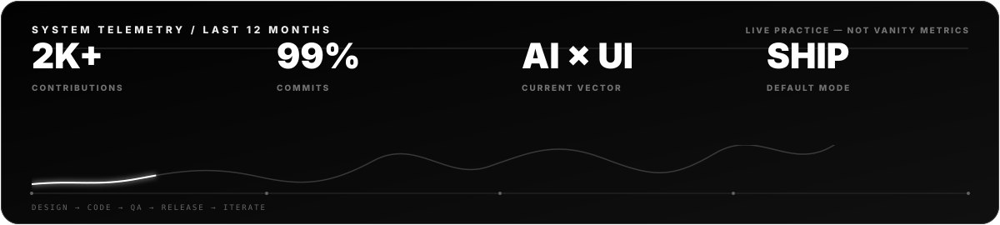

<div align="center">
  
</div>

<br />

<div align="center">
  <a href="https://buildary.dev"></a>
  <a href="https://codionx.com"></a>
  
</div>

## `01 / WHO I AM`

I’m **Mirza Şimşek** — a software engineering undergraduate, product engineer at **[CodionX](https://codionx.com)**, and the builder behind experiments that live where **AI, product design and full-stack systems** collide.

I’ve been making things since childhood: not because one stack was fashionable, but because an idea felt too interesting to leave imaginary. Today that instinct turns into AI-native products, original block libraries, research agents, marketplace systems, mobile apps and interfaces designed all the way from first principle to production edge.

> **I don’t collect demos. I build the system behind the demo.**

```ts
const mirza = {
  role: ["AI Product Builder", "Software Engineering Student"],
  studio: "CodionX",
  defaultMode: "turn the strange idea into the working product",
  caresAbout: ["original interaction models", "design systems", "reliable architecture"],
  currentSignal: "shipping Buildary and a constellation of AI-native products",
};
```

## `02 / PRODUCT CONSTELLATION`

<div align="center">
  
</div>

### The flagship — [Buildary](https://buildary.dev)

**Türkiye’s first open-source, AI-native web builder.** No drag-and-drop maze and no theme archaeology: describe what you need, let the system construct it, inspect its own work and make sure the result holds together on real screens.

### The public build — [NeedGo](https://github.com/aethrixn/needgo)

A reverse marketplace for second-hand products. Instead of publishing an item and waiting, a seller sees verified people already looking for it — backed by price discovery, matching, escrow-shaped flows, privacy boundaries and production-minded failure modes.

### The wider lab

- **Spatial AI** — Change Home–style experiences that can reinterpret and redesign a room from an image.
- **Visual commerce** — AI pipelines that replace vehicle-listing and studio-photo backgrounds so the subject looks like it was actually shot in a better environment.
- **Research systems** — research agents and long-form copilots for evidence gathering, articles and thesis workflows.
- **Original UI infrastructure** — reusable block libraries, design systems and interaction models built for products rather than screenshots.

## `03 / EARLY SIGNALS`

Before “Study Mode” became a familiar product pattern, I was already arguing in Türkiye for AI experiences that **teach, question and scaffold thinking** instead of merely returning an answer — the direction later made visible in products such as Perplexity and Gemini.

The archive is intentionally hard to categorize: market and portfolio tools, faith and daily-ritual apps, social products, publishing systems, AI-assisted writing, mobile experiments, visual concepts and more. Different surfaces; the same obsession with finding the useful interaction nobody has named clearly yet.

<details>
  <summary><strong>Open the product archive // more signals</strong></summary>
  <br />

  - AI web creation and modular page architecture
  - Interior redesign and image-to-space concepts
  - Automotive and studio-scene background intelligence
  - Research agents, article systems and thesis copilots
  - Market, portfolio and trading-oriented experiments
  - Faith, time and daily-practice applications
  - Social platforms, community mechanics and messaging flows
  - Original component systems, block libraries and interaction studies
  - Product UI, brand systems and high-fidelity design explorations
</details>

## `04 / THE SYSTEMS I REACH FOR`

<div align="center">
  
  
  
  
  
  
  
  
  
</div>

<br />

I choose tools by the shape of the problem. The recurring core is **TypeScript + React/Next.js** for product surfaces, **Flutter/Dart** for mobile, **Python** for AI and automation, and **PostgreSQL/Supabase** when the product needs a real data boundary. The important part is not the logo wall; it is making the seams disappear for the person using the thing.

## `05 / LIVE SYSTEM TELEMETRY`

<div align="center">
  
</div>

## `06 / CONTRIBUTION SIGNAL`

<div align="center">
  <picture>
    <source media="(prefers-color-scheme: dark)" srcset="https://raw.githubusercontent.com/aethrixn/aethrixn/output/github-snake-dark.svg" />
    <source media="(prefers-color-scheme: light)" srcset="https://raw.githubusercontent.com/aethrixn/aethrixn/output/github-snake.svg" />
    
  </picture>
</div>

<div align="center"><sub>The graph regenerates itself every night. The signal stays alive.</sub></div>

## `07 / BUILD PHILOSOPHY`

| Principle | What it means in practice |
| --- | --- |
| **Product before ornament** | The interaction has to make sense before the glow does. |
| **Design is architecture** | Tokens, components, states and responsive behavior are one system. |
| **AI needs boundaries** | Useful agents need tools, evidence, permissions and honest failure modes. |
| **Prototype → prove → productize** | I move fast, then harden what deserves to survive. |
| **Ship the whole loop** | Interface, data, operations, QA and the awkward edge cases all count. |

## `08 / OPEN SOURCE & CONTACT`

- **[claudecode-prompt](https://github.com/aethrixn/claudecode-prompt)** — an early open look at the system instructions behind an agentic coding workflow.
- **[NeedGo](https://github.com/aethrixn/needgo)** — a production-minded reverse marketplace, built in public.
- **[Buildary](https://buildary.dev)** — the current flagship: tell it what to build, then let it reason through the page.

<div align="center">
  <br />
  <a href="https://codionx.com"></a>
  <a href="https://github.com/aethrixn?tab=repositories"></a>
  <br />
  <br />
  <sub><strong>Currently:</strong> turning ambitious product ideas into systems that can survive contact with reality.</sub>
</div>

